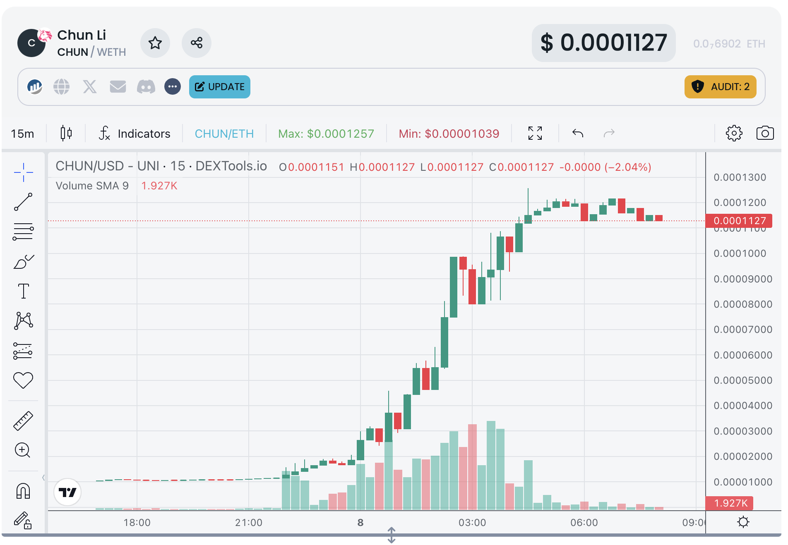
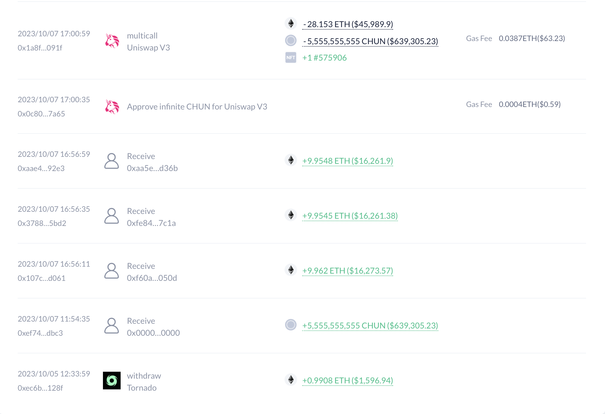
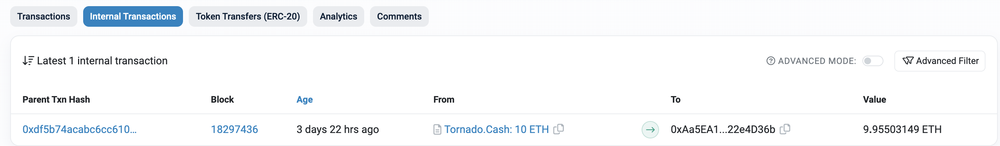
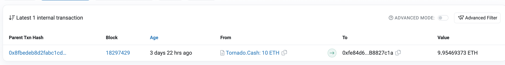
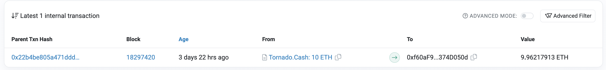
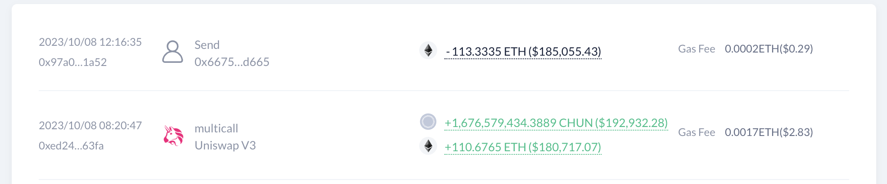
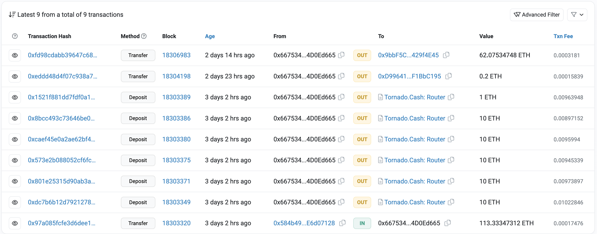
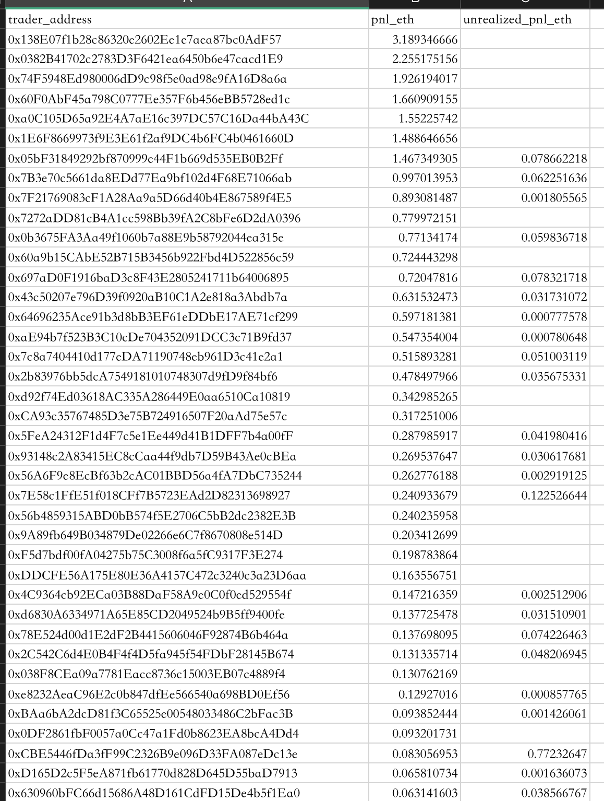

# 一只普通土狗的生生死死

# 缘起
很多人不懂土狗，有些人对土狗感到好奇，有些人想赚快钱，有些人想找聪明钱，于是就有了这篇文章。
我通过下面的sql在transpose上发现了它，它是那几分钟里最幸运的lucky dog。
```sql
SELECT
    to_token_address,
    COUNT(*) AS tx_counts
FROM
    ethereum.dex_swaps
WHERE
    TIMESTAMP > (NOW() - INTERVAL '15 minutes')
    AND to_token_address NOT IN (
        '0xC02aaA39b223FE8D0A0e5C4F27eAD9083C756Cc2',
        '0xdAC17F958D2ee523a2206206994597C13D831ec7',
        '0xA0b86991c6218b36c1d19D4a2e9Eb0cE3606eB48'
    )
GROUP BY
    to_token_address
ORDER BY
    tx_counts DESC;
```


# 追索
但它其实只是一只普通的土狗，代号CHUN。代币地址在 https://etherscan.io/address/0x91e9db6909654f5bdf497d69388924b1ce04de9f
它的生命持续了两天，从10月7号的下午到8号的早上，之后流动性被抽走，再没有一笔交易。有点不一样的是，它走的还是很辉煌的。

https://www.dextools.io/app/en/ether/pair-explorer/0x8ff5075c9875ef9ac1bbd296e964cbb38537c90e
它的创造者是0x584b495632685ccc3be663003d88c21be6d07128，所有的资金源头都来自于Tornado
https://debank.com/profile/0x584b495632685ccc3be663003d88c21be6d07128/history




总投入大约29E最终收益是110E

最终都汇入回Tornado


# 谁从它身上赚到钱了呢？
我通过以下的sql在transpose上找到了一些地址
```sql
WITH
    rlzd AS (
        SELECT
            trader_address,
            SUM(eth_price) AS pnl_eth
        FROM
            (
                SELECT
                    origin_address AS trader_address,
                    SUM(- quantity_in / 1e18) AS eth_price
                FROM
                    ethereum.dex_swaps ds
                    LEFT JOIN ethereum.contract_labels cl ON cl.contract_address = origin_address
                WHERE
                    from_token_address = '0xC02aaA39b223FE8D0A0e5C4F27eAD9083C756Cc2'
                    AND to_token_address = '0x91e9db6909654f5bdf497d69388924b1ce04de9f'
                    AND cl.labels ISNULL
                GROUP BY
                    1
                UNION ALL
                SELECT
                    origin_address AS trader_address,
                    SUM(quantity_out / 1e18) AS eth_price
                FROM
                    ethereum.dex_swaps ds
                    LEFT JOIN ethereum.contract_labels cl ON cl.contract_address = origin_address
                WHERE
                    from_token_address = '0x91e9db6909654f5bdf497d69388924b1ce04de9f'
                    AND to_token_address = '0xC02aaA39b223FE8D0A0e5C4F27eAD9083C756Cc2'
                    AND cl.labels ISNULL
                GROUP BY
                    1
            ) s
        GROUP BY
            1
    ),
    unrlzd AS (
        SELECT
            owner_address AS trader_address,
            (balance / 10 ^ decimals) * tok_price_usd / eth_price_usd AS unrealized_eth_price
        FROM
            ethereum.token_owners own
            NATURAL JOIN (
                SELECT
                    close_price AS tok_price_usd
                FROM
                    ethereum.token_prices_ohlc_1d ohlc
                WHERE
                    token_address = '0x91e9db6909654f5bdf497d69388924b1ce04de9f'
                ORDER BY
                    TIMESTAMP DESC
                LIMIT
                    1
            ) tok_price
            NATURAL JOIN (
                SELECT
                    close_price AS eth_price_usd
                FROM
                    ethereum.token_prices_ohlc_1d ohlc
                WHERE
                    token_address = '0xC02aaA39b223FE8D0A0e5C4F27eAD9083C756Cc2'
                ORDER BY
                    TIMESTAMP DESC
                LIMIT
                    1
            ) eth_price
            NATURAL JOIN (
                SELECT
                    decimals
                FROM
                    ethereum.tokens t
                WHERE
                    contract_address = '0x91e9db6909654f5bdf497d69388924b1ce04de9f'
            ) tok_decimals
            LEFT JOIN ethereum.contract_labels cl ON cl.contract_address = owner_address
        WHERE
            own.contract_address = '0x91e9db6909654f5bdf497d69388924b1ce04de9f'
            AND cl.labels ISNULL
    )
SELECT
    rlzd.*,
    unrlzd.unrealized_eth_price AS unrealized_pnl_eth
FROM
    rlzd
    LEFT JOIN unrlzd USING (trader_address)
ORDER BY
    pnl_eth DESC;
```
总共有71个账户从它身上赚到了钱，最多只赚了3E，大概是庄家的零头

其中
0x138E07f1b28c86320e2602Ee1e7aea87bc0AdF57
0x0382B41702c2783D3F6421ea6450b6e47cacd1E9
0x74F5948Ed980006dD9c98f5e0ad98e9fA16D8a6a
0xa0C105D65a92E4A7aE16c397DC57C16Da44bA43C
0x1E6F8669973f9E3E61f2af9DC4b6FC4b0461660D
的资金都来源于同一地址，基本可以判断是同一家，垄断了大部分收益。仔细看下来，赚钱的基本都是机器人。账号都是一次性的，跟踪难度很大。

# 谁亏钱了呢？
亏钱的账号很多，其中很多像是庄家用来抬轿的的账号，可以看出庄家拉盘也花了很多成本，其中一个比较典型的账号是https://etherscan.io/address/0x99b56cb5c120b8fa391056d20eb4f56ee9b57605 ， 是一个有ens域名的nft和土狗玩家，从他的操作上看有赚有亏。

# 结语
这不是一只像pepe一样的金狗，只是一只普普通通的土狗，这也只是一次普普通通的追踪，希望能对大家产生一点启发。