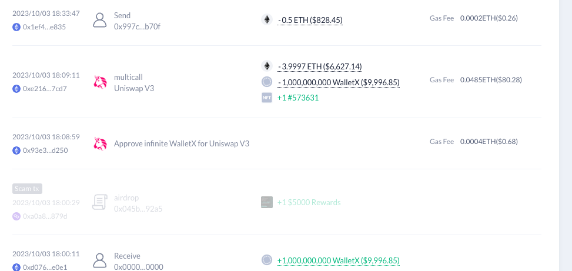

# 一个简单的打新策略

## 起因

我追踪热门币种的时候发现了一个币: 0xae1ff03aefa5af236ed6a71fc68e234d1667a11e，这是一个貔貅盘。

然后我就开始追踪这个盘的建立者  
https://debank.com/profile/0x8f14cae6c8a38f1bea1ed26787b329f248bf0380/history

然后追踪这个账号最初始的ETH来源，找到了这个地址
https://debank.com/profile/0xbb7fc25c563534dd54d0305d7ea3f96f0cb4a4ab/history

发现另一个资金去向也发了一个币，也是一摸一样的玩法。从5个以太坊赚到30个以太坊。 https://debank.com/profile/0xf90638933bb804adaf798fa2554522c5bfc20471/history

总的下来，这个资金用10个以太赚到了80多个以太。

## 模式分析

这个模式看起来很成熟了，他的很多交易都是同个区块的连号交易，于是我就好奇，这个模式的利益来源时什么呢？

猜测1: 黑钱在洗钱。

猜测2: 有某种方式获得流量。

通过分析交易，我发现这个过程，两个账号都把0.5E转给了同一个地址，分析这个地址发现它每天都有收入。
https://etherscan.io/address/0x997cc123cf292f46e55e6e63e806cd77714db70f

于是我就好奇到底为什么呢？最后发现这个地址是 https://www.dextools.io/app/en/pairs 上传头像的收款地址。

## 策略分析

然后我就发现有些账号通过跟踪 dextool 的收款账号来进行打新。一旦有地址转账就购买这个地址发行的币种。社区里也已经有bot在监控这个地址了。https://chainbot.io/bot/356244844022365733

从结果上来看，效果似乎还可以。
这是最近的一笔交易。
https://etherscan.io/tx/0x2e4f9c1cc5f933e797b86623261b59b4baa9bf2889b0c16368c7a06e13558638

可以看到发布之后价格就开始向上飙升。